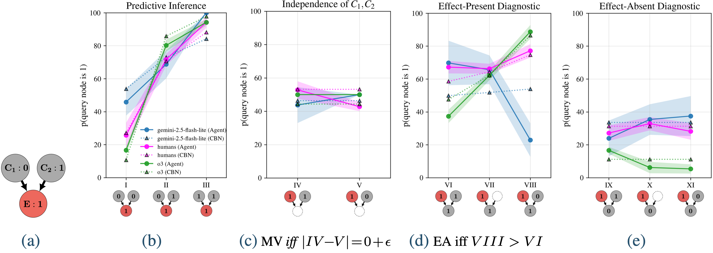
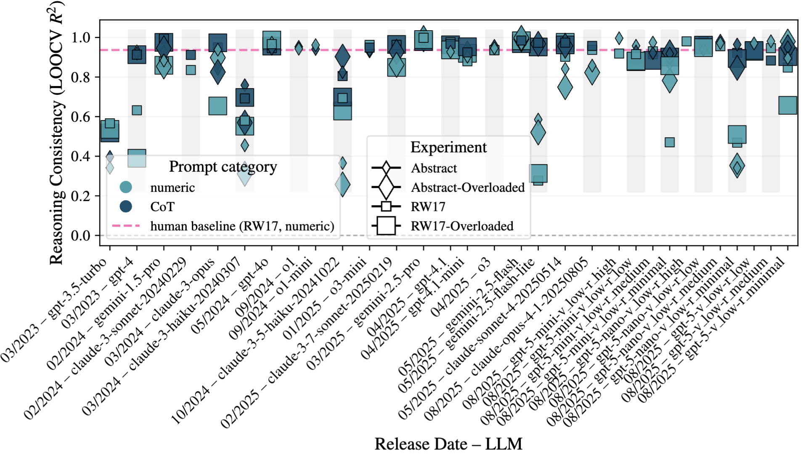

# Contrasting Reasoning in Humans and Large Language Models On a Causal Benchmark
## Reasoning Strategies and Robustness in Language Models -- A Cognitive View

## **Overview**


**causAIign** is a Python toolkit for evaluating **Large Language Model (LLM) causal reasoning** across  common-effect (collider) structures and comparing it with human responses on the same set of tasks. It ships a **human benchmark** for collider tasks built to match the experimental paradigm of [Rehder&Waldmann, 2017](https://link.springer.com/article/10.3758/s13421-016-0662-3) (RW17), enabling **apples-to-apples comparisons between LLMs and humans**. Using the same task templates as the human benchmark, the package lets you **generate new causal inference prompts** that preserve the exact task pattern while (i) varying content (e.g., fully abstract, or your own fantasy/real-world common-effect stories) and (ii) systematically injecting irrelevant details to dilute the signal-to-noise ratio (overloaded). Utilities are included for collecting LLM responses based on different prompt instructions (e.g., chain-of-thought), fitting causal Bayes nets to responses, and aggregating results for transparent, reproducible comparisons across LLMs and humans (more details below).

### Why collider graphs?
Humans show biases in collider graph based reasoning tasks repeatedly shown by a plethora of studies. An important question this package facilitates in answering is whether LLMs replicate these biases. 


## **Installation**

To install the package, clone the repository and install dependencies:

```bash
git clone <https://github.com/hmd101/causalign.git>
cd causalign
pip install -e .

```

If you want to install directly from a public GitHub repository:

```bash
pip install git+https://github.com/hmd101/causalign.git
```

## Quickstart

Run LLMs on prompts (writes raw outputs under data/output_llm/):

```bash
python scripts/02_llm_and_processing/run_llm_prompts.py --delegate run_experiment -- --version 3 --experiment pilot_study --model gpt-4o
```

Process accumulated outputs into tidy datasets (optionally merges with human data):

```bash
python scripts/02_llm_and_processing/run_llm_prompts.py --delegate pipeline -- --experiment pilot_study --version 3
```

Next steps:
- Fit CBNs and export winners for downstream analyses: see scripts/04_cbn_fit_and_eval/README.md
- Publication-ready plots and summaries: see scripts/05_downstream_and_viz/README.md


### The following analysis pipeline is supported by the package:
- Q1 Cover story (domain) differences (Kruskal–Wallis + multiple comparison corrections)
- Q2 Human–LLM alignment (Spearman ρ with bootstrap CIs)
- Q3 Normative reasoning: is there a set of causal Bayes net parameters that describes an agent's likelihood judgments across different causal inference tasks well? (loss/RMSE/MAE/R²)
- Q4 Reasoning consistency (task-level LOOCV R²)
- Q5 Cognitive strategies (deterministic, rule-based  vs. probabilistic signatures reasoning; parameter patterns, levels of explaining away (EA) and Markov violations (MV))
- Q6 Robustness to content (e.g. abstract) and prompt (e.g. chain-of-thougt) manipulations 

### Example causAIign plots:
####  Comparing LLM and human likelihood judgments across collider-based tasks; dashed curves indicate predictions from each agent’s fitted noisy-OR causal Bayes network

_The red node is the query node, gray nodes are observed, and when we don't provide any information about a node in the causal task, it is represented as a dashed circle._

#### Reasoning consistency across LLMs and experimental manipulations compared to human baseline (pink)

_A note on prompt-category naming: We refer to single-shot outputs (i.e., a single number for the likelihood of the query node being 1 (red node in graphs above)) as **Numeric** and contrast it to chain-of-thought (CoT)._


## Documentation

Detailed guides live under READMEs/:
- READMEs/README_Workflow.md – end-to-end workflow and structure
- READMEs/PROMPT_GENERATION_GUIDE.md – creating prompts and overlays
- READMEs/DATA_PROCESSING_GUIDE.md – processing pipeline and merging with humans
- READMEs/STATISTICAL_TESTS_README.md – statistical analysis plan and hypotheses
- READMEs/README_EA_MV.md – EA/MV reasoning signatures and interpretation
- READMEs/STABILITY_METRICS.md – optimization stability metrics and thresholds
- READMEs/API_USAGE.md – programmatic API examples
- READMEs/TESTING.md – running tests


## Some Results at a glance

- LLMs can follow causal rules, often more rigidly than people (deterministic reasoning). Most models apply the intended causal rules in a repeatable, near-deterministic way; a minority behave _more_ probabilistically  than humans and lean on associations.
- Chain-of-thought mainly boosts reliability; under noise it also improves reasoning quality. Asking for intermediate steps increases consistency and, when prompts include irrelevant text, shifts behavior toward the intended causal rules.
- Changing the knowledge domain that causal inference tasks are embedded in doesn’t matter much; _adding irrelevant text does_! Swapping real-world content for abstract placeholders leaves reasoning intact, while appended irrelevant sentences reduce consistency and increase associative behavior; CoT recovers much of this loss.
- Two behavioral regimes emerge. A deterministic, rule-following regime (low reliance on associations) and a probabilistic, association-heavy regime. Frontier models cluster in the former; smaller/earlier models more often fall into the latter.
- Chain-of-thought seems to disproportionately benefit smaller / older models.
- Gemini-2.5-pro emerges as
- NOTE: Deterministic reasoning is not always better. Because the real world is intrinsically noisy, it is essential to characterize LLM reasoning strategies in detail to support their safe and effective use.