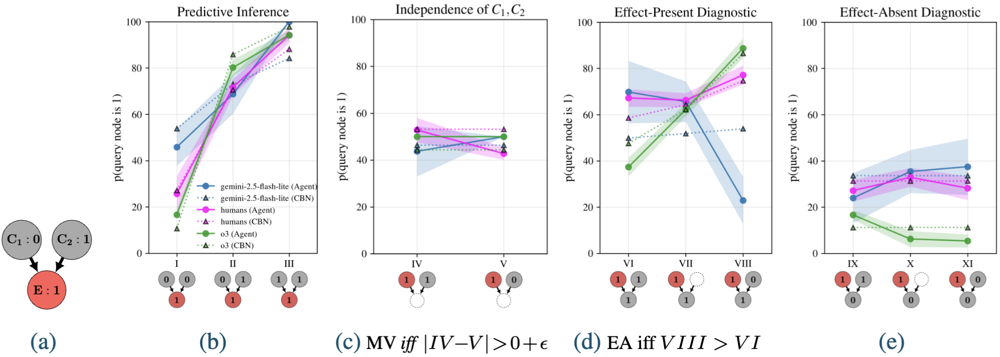

# CausAlign -- Contrasting Reasoning in Humans and Large Language Models On a Causal Benchmark
## Reasoning Strategies and Robustness in Language Models -- A Cognitive View

## **Overview**

CausAlign is a Python package for evaluating the causal reasoning abilities and strategies of **Large Language Models (LLMs)** in comparison with humans. It provides tools to systematically assess _how_ LLMs reason about causal structures, with a particular focus on **collider** graphs, where **human biases** are especially well documented.
A central question we investigate is whether LLMs reproduce human biases in these causal systems. Our findings suggest that, for the most part, they do not.
The package also supports **custom prompt creation** using the same scaffolding as our benchmark, enabling direct comparison across experiments. This makes it possible to explore questions such as:
- How do LLMs behave on tasks stripped of semantically meaningful content?
- How easily are they distracted when irrelevant information is introduced, reducing the signal-to-noise ratio?

## **Installation**

To install the package, clone the repository and install dependencies:

```bash
git clone <https://github.com/hmd101/causalign.git>
cd causalign
pip install -e .

```

If you want to install directly from a public GitHub repository:

```bash
pip install git+https://github.com/hmd101/causalign.git
```

## Quickstart

Run LLMs on prompts (writes raw outputs under data/output_llm/):

```bash
python scripts/02_llm_and_processing/run_llm_prompts.py --delegate run_experiment -- --version 10 --experiment pilot_study --model gpt-4o
```

Process accumulated outputs into tidy datasets (optionally merges with human data):

```bash
python scripts/02_llm_and_processing/run_llm_prompts.py --delegate pipeline -- --experiment pilot_study --version 10
```

Next steps:
- Fit CBNs and export winners for downstream analyses: see scripts/04_cbn_fit_and_eval/README.md
- Publication-ready plots and summaries: see scripts/05_downstream_and_viz/README.md


## Results at a glance

- LLMs can follow causal rules, often more rigidly than people (deterministic reasoning). Most models apply the intended causal rules in a repeatable, near-deterministic way; a minority behave more probabilistically and lean on associations.
- Chain-of-thought mainly boosts reliability; under noise it also improves reasoning quality. Asking for intermediate steps increases consistency and, when prompts include irrelevant text, shifts behavior toward the intended causal rules.
- Changing the knowledge domain that causal inference tasks are embedded in doesn’t matter much; _adding irrelevant text does_! Swapping real-world content for abstract placeholders leaves reasoning intact, while appended irrelevant sentences reduce consistency and increase associative behavior; CoT recovers much of this loss.
- Two behavioral regimes emerge. A deterministic, rule-following regime (low reliance on associations) and a probabilistic, association-heavy regime. Frontier models cluster in the former; smaller/earlier models more often fall into the latter.
- Scope and limits. Findings are behavioral. With proprietary models, we can’t ascribe mechanisms; patterns should be read as consistent behavioral trends under our tasks.

What these findings measure (produced by this package):
- Q1 Domain differences (Kruskal–Wallis + BH–FDR)
- Q2 Human–LLM alignment (Spearman ρ with bootstrap CIs)
- Q3 Normativity via CBN fits (loss/RMSE/MAE, LOOCV R²)
- Q4 Reasoning consistency (task-level LOOCV R²)
- Q5 Cognitive strategies (EA/MV signatures; parameter patterns)
- Q6 Robustness to content manipulations

### Example output plot generated with causAIign:


## Documentation

Detailed guides live under READMEs/:
- READMEs/README_Workflow.md – end-to-end workflow and structure
- READMEs/PROMPT_GENERATION_GUIDE.md – creating prompts and overlays
- READMEs/DATA_PROCESSING_GUIDE.md – processing pipeline and merging with humans
- READMEs/STATISTICAL_TESTS_README.md – statistical analysis plan and hypotheses
- READMEs/README_EA_MV.md – EA/MV reasoning signatures and interpretation
- READMEs/STABILITY_METRICS.md – optimization stability metrics and thresholds
- READMEs/API_USAGE.md – programmatic API examples
- READMEs/TESTING.md – running tests


## **Data and Models**
causAlign provides support for evaluating LLMs across  causal inference tasks embedded in a collider, chain and fork graph structure. A human benchmark currently only exists for the collider graph. It is particularly apt for datasets building on experiments in  [Rehder&Waldmann, 2017](https://link.springer.com/article/10.3758/s13421-016-0662-3).


# Package organization

```
src/causalign/
├── prompts/                      
│   ├── core/                    # Core prompt generation logic
│   │   ├── domain.py           # Domain-specific logic
│   │   ├── verbalization.py    # Story verbalization
│   │   ├── prompt.py          # Prompt templates
│   │   └── constants.py       # Shared constants
│   ├── generators/             # Different graph type generators
│   │   ├── collider.py
│   │   ├── fork.py
│   │   └── chain.py
│   ├── versions/              # Different prompt versions
│   │   ├── rw17/             # Rehder & Waldmann 2017
│   │   ├── abstract/
│   │   └── fantasy/
│   └── notebooks/            # Prompt generation notebooks
│
├── data/                      # Data management
│   ├── raw/                  # Raw data
│   │   ├── human/           # Human response data
│   │   └── llm/            # Raw LLM responses
│   ├── processed/           # Processed data
│   │   ├── human/          # Processed human data
│   │   └── llm/           # Processed LLM responses
│   └── merged/             # Merged datasets
│       └── rw17/          # RW17 specific merged data
│
├── experiment/               # Experiment execution
│   ├── api/                # API clients and configuration
│   │   ├── base.py
│   │   ├── openai.py
│   │   └── anthropic.py
│   └── config/            # Experiment configuration
│
└── analysis/               # Analysis and visualization
    ├── processing/        # Data processing
    │   ├── response_parser.py    # XML parsing of LLM output
    │   ├── roman_numerals.py    # Roman numeral conversion
    │   └── data_merger.py       # Merging human and LLM data
    ├── visualization/     # Plotting and visualization
    │   ├── line_plots.py
    │   └── detailed_responses.py
    └── notebooks/        # Analysis notebooks
```

